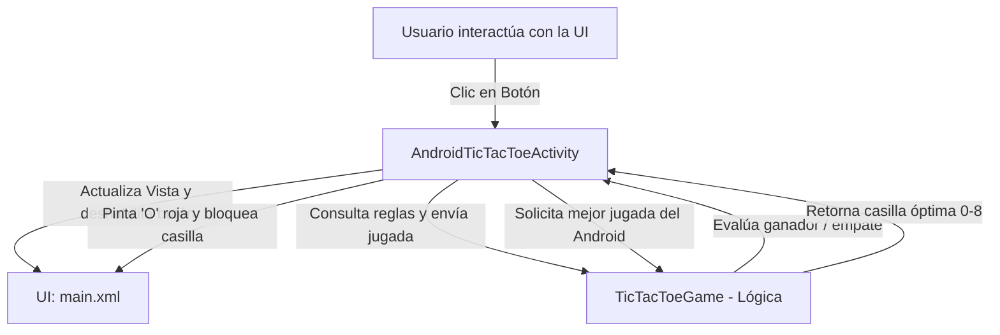

# Documentación de la Aplicación Android Tic-Tac-Toe (Triqui / Tres en Línea)

Este documento detalla a grandes rasgos el funcionamiento, la arquitectura y el flujo de ejecución de la aplicación desarrollada siguiendo la guía de laboratorio *Android Application Programming Challenge: Tic-Tac-Toe App*.

---

## 1. Visión General y Arquitectura

La aplicación implementa el clásico juego de **Tres en Línea (Tic-Tac-Toe)** para Android, separando de forma limpia la **lógica del juego (Modelo)** de la **interfaz de usuario (Controlador / Vista)**:

Esta separación permite modificar la apariencia visual (tamaño de botones, colores o disposición) sin afectar en absoluto la lógica de detección de ganadores o el comportamiento de la computadora.

---

## 2. Componentes Principales

### A. Modelo de Juego: [`TicTacToeGame.java`](file:///c:/Users/manue/AndroidStudioProjects/AndroidTicTacToe/app/src/main/java/com/example/androidtictactoe/TicTacToeGame.java)
Es una clase pura en Java sin dependencias de Android. Se encarga de:
- **Estado del tablero:** Mantiene un arreglo `char mBoard[]` de 9 posiciones (índices del 0 al 8) representando el tablero 3x3:
  - Posición vacía: `' '` (`OPEN_SPOT`)
  - Jugador humano: `'X'` (`HUMAN_PLAYER`)
  - Computadora: `'O'` (`COMPUTER_PLAYER`)
- **Limpieza del tablero (`clearBoard`):** Inicializa todas las posiciones con espacios vacíos al comenzar una nueva partida.
- **Asignación de jugada (`setMove`):** Valida que la posición esté disponible antes de guardar la marca.
- **Detección de ganador (`checkForWinner`):**
  - Evalúa las 3 filas horizontales, 3 columnas verticales y 2 diagonales.
  - Retorna `2` si ganó el humano (`X`), `3` si ganó la computadora (`O`), `1` si hay empate (tablero lleno sin ganador) o `0` si el juego aún sigue en curso.
- **Inteligencia Artificial de la Computadora (`getComputerMove`):**
  1. **Ganar:** Revisa si la computadora puede ganar en este turno con alguna casilla libre. Si es así, la toma.
  2. **Bloquear:** Revisa si el humano puede ganar en su siguiente turno. Si encuentra una casilla peligrosa, la toma para bloquearlo.
  3. **Aleatorio:** Si no puede ganar ni necesita bloquear inmediatamente, elige una casilla libre al azar usando un generador aleatorio (`Random`).

---

### B. Interfaz Gráfica (UI): [`main.xml`](file:///c:/Users/manue/AndroidStudioProjects/AndroidTicTacToe/app/src/main/res/layout/main.xml)
- **Contenedor Principal (`LinearLayout`):** Con orientación vertical, centrado en pantalla y con `fitsSystemWindows="true"` para evitar que la barra de estado o cabecera oculte el juego.
- **Cuadrícula del Juego (`TableLayout` con 3 `TableRow`s):**
  - Contiene 9 botones cuadrados (`one` a `nine`), cada uno de 100dp x 100dp con texto grande de 70dp.
- **Texto de Estado (`TextView` `@+id/information`):** Indica de quién es el turno o el resultado de la partida ("You go first.", "Android's turn.", "You won!", etc.).
- **Marcador de Puntuación (`RelativeLayout` `@+id/score_board`):**
  - Ubicado en la parte inferior con fondo oscuro.
  - Muestra en columnas alineadas los contadores: `Human: X`, `Ties: Y` y `Android: Z`.

---

### C. Controlador: [`AndroidTicTacToeActivity.java`](file:///c:/Users/manue/AndroidStudioProjects/AndroidTicTacToe/app/src/main/java/com/example/androidtictactoe/AndroidTicTacToeActivity.java)
Conecta la interfaz gráfica con el modelo de juego:
- **Inicialización (`onCreate`):**
  - Carga la vista `R.layout.main`.
  - Conecta los 9 botones en un arreglo `mBoardButtons[]` mediante `findViewById`.
  - Enlaza el `TextView` de estado y los marcadores de puntaje.
  - Instancia `mGame` y llama a `startNewGame()`.
- **Inicio de Partida (`startNewGame`):**
  - Limpia el modelo con `mGame.clearBoard()`.
  - Habilita los 9 botones, limpia sus textos y les asigna un `ButtonClickListener(i)`.
  - Reinicia la bandera `mGameOver = false`.
  - Alterna quién inicia el turno: si inicia el humano muestra el mensaje correspondiente; si le toca a la máquina, esta realiza su primer movimiento inmediatamente.
- **Dibujo de jugada (`setMove`):**
  - Actualiza el modelo, deshabilita el botón presionado y le asigna el color correspondiente:
    - **Verde** (`Color.rgb(0, 200, 0)`) para la `'X'`.
    - **Rojo** (`Color.rgb(200, 0, 0)`) para la `'O'`.
- **Escuchador de clics (`ButtonClickListener`):**
  - Cuando el usuario toca una casilla habilitada:
    1. Se coloca la `'X'` del humano.
    2. Se comprueba si el humano ganó o empató.
    3. Si el juego continúa (`winner == 0`), la computadora calcula su jugada óptima (`getComputerMove`), coloca su `'O'` y se vuelve a comprobar el estado de la partida.
    4. Si hay un desenlace (victoria, derrota o empate), se actualiza el mensaje de estado desde `strings.xml`, se actualiza el marcador numérico, se marca `mGameOver = true` (bloqueando clics futuros) y se invierte el turno inicial para la siguiente partida.
- **Menú de Opciones (`onCreateOptionsMenu` / `onOptionsItemSelected`):**
  - Agrega la opción **"New Game"** en el menú de la aplicación para reiniciar la partida en cualquier momento.

---

### D. Recursos de Cadenas: [`strings.xml`](file:///c:/Users/manue/AndroidStudioProjects/AndroidTicTacToe/app/src/main/res/values/strings.xml)
Evita textos fijos (hardcodeados) en el código Java y centraliza los mensajes para permitir internacionalización o modificaciones rápidas:
- `first_human`: "You go first."
- `first_android`: "Android goes first."
- `turn_human`: "Your turn."
- `turn_computer`: "Android's turn."
- `result_tie`: "It's a tie."
- `result_human_wins`: "You won!"
- `result_computer_wins`: "Android won!"
- Formatos de puntaje: `Human: %d`, `Ties: %d`, `Android: %d`.

---

## 3. Flujo Paso a Paso de una Partida

1. **Apertura de la App:** Se dibuja la cuadrícula centrada con los 9 botones en blanco y habilitados. El mensaje inferior indica *"You go first."*.
2. **Turno del Humano:** El jugador pulsa una casilla. Inmediatamente aparece una **X verde**, el botón queda deshabilitado y se actualiza el mensaje a *"Android's turn."*.
3. **Turno de Android:** La IA evalúa el tablero. Si puede ganar o necesita bloquear, selecciona esa casilla; de lo contrario elige una al azar. Coloca una **O roja** y deshabilita la casilla.
4. **Fin de Juego:** Cuando se forma una línea de 3 o se llena el tablero:
   - Se muestra el resultado final (*"You won!"*, *"Android won!"* o *"It's a tie."*).
   - Se incrementa el contador correspondiente en la barra inferior.
   - La variable `mGameOver` pasa a `true`, impidiendo que se sigan pulsando casillas.
5. **Nueva Partida:** El usuario selecciona **"New Game"** en el menú superior/de opciones. El tablero se limpia y, gracias al reto adicional (*Extra Challenge*), ahora es el turno de la computadora para abrir la partida.
